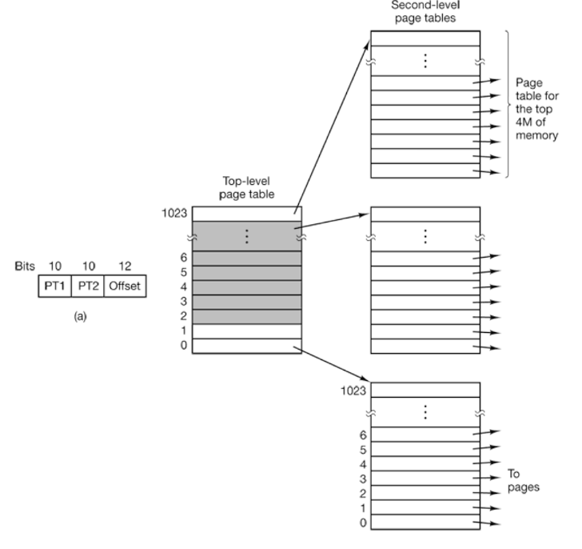

## Admin
:::{.nonincremental}
- Midterm 2 on Thursday
- No quiz this week
- Lab due 3/2
:::

# Memory review {background-color="#40666e"}

## The rule that drives everything

- [Page tables must be page-sized]{.alert}
  - A page table is just another data structure stored in memory
  - The OS allocates exactly **one page** (4 KB) to hold each page table
  - Why? So page tables themselves can be managed by the paging system — no special-case allocator needed
- This constraint propagates to everything else:
  - entry size → number of entries → bits consumed per level

## Two-level page tables (32-bit)

- 32-bit virtual address: split as **10 | 10 | 12**
  - 12-bit offset → 4 KB pages ($2^{12}$ bytes)
  - Each entry is **4 bytes** → entries per table = $4096 / 4 = 1024 = 2^{10}$ → **10-bit index**
- Two-level structure:
  - **Page Directory** (top): 1024 entries, each pointing to a Page Table
  - **Page Table** (bottom): 1024 entries, each pointing to a physical frame
- Key win: if a Page Directory entry is marked invalid, its entire Page Table **need not exist in memory** at all
  - With only a few tables resident, e.g. 4 × 4 KB = 16 KB instead of 4 MB

## Two-level page table: address breakdown

:::: {.columns}
::: {.column width="50%"}
| Field | Bits | Meaning |
|-------|------|---------|
| PT1 (dir index) | 10 | which page table |
| PT2 (page index) | 10 | which entry in that table |
| Offset | 12 | byte within page |

- $2^{10}$ entries × 4 bytes = 4,096 bytes = **exactly one page**
:::
::: {.column width="2%"}
:::
::: {.column width="48%"}

:::
::::

## PAE: the problem

- Classic 32-bit: max physical memory = 4 GB
  - Page table entries only hold a 20-bit physical frame number (PFN)
  - Servers needed more RAM — hardware could address 36 bits (64 GB), but the PTE couldn't hold it
- Fix: **widen each PTE from 4 bytes → 8 bytes**
  - Now the PFN field can hold 36-bit physical addresses
- But remember the rule: **page tables must be page-sized (4 KB)**

## PAE: why 9-bit indices?

- Entry size doubled → table capacity halved:
  $$4096 \text{ bytes} \div 8 \text{ bytes/entry} = 512 \text{ entries} = 2^9$$
- So each level now uses a **9-bit index**, not 10-bit
- Accounting for a 32-bit virtual address:
  - 12 bits: page offset (unchanged)
  - 9 bits: Page Directory index
  - 9 bits: Page Table index
  - **2 bits left over** → used as index into a tiny new top level: the **Page Directory Pointer Table (PDPT)**
    - PDPT has only 4 entries (2 bits) and fits in 32 bytes — not even a full page

## PAE: side-by-side

:::: {.columns}
::: {.column width="48%"}
**Classic 32-bit (no PAE)**

| Field | Bits |
|-------|------|
| Page Directory | 10 |
| Page Table | 10 |
| Offset | 12 |

- Entry size: **4 bytes**
- Entries per table: **1024**
- Max physical: **4 GB**
:::
::: {.column width="4%"}
:::
::: {.column width="48%"}
**PAE (36-bit physical)**

| Field | Bits |
|-------|------|
| PDPT index | 2 |
| Page Directory | 9 |
| Page Table | 9 |
| Offset | 12 |

- Entry size: **8 bytes**
- Entries per table: **512**
- Max physical: **64 GB**
:::
::::

- [Same rule, different entry size → different bit split]{.alert}

## PAE: what changed, what didn't

- **Changed**
  - PTE size: 4 → 8 bytes (holds 36-bit PFN)
  - Entries per table: 1024 → 512 (10-bit → 9-bit index)
  - Added PDPT level (uses the 2 leftover bits)
  - Total *system* physical address space: 4 GB → 64 GB
- **Unchanged**
  - Virtual address is still 32 bits
  - Each *process* is still limited to 4 GB virtual address space
  - Page size: still 4 KB
  - Page tables are still exactly one page each (4 KB)

## How do we get 36-bit physical addresses with only 32-bit virtual addresses?
- The virtual address space is still 32 bits, so each process can only address 4 GB of memory
- Total *system* physical address space: 4 GB → 64 GB
  - How? The OS effectively **adds 4 extra bits** to every physical address
  - A process issues a 32-bit virtual address; the OS translates it through page tables whose entries store **36-bit** physical frame numbers
  - The process has no access to those upper 4 bits — only the OS decides where in physical memory a page lands
  - Different processes can be mapped to completely different 4 GB regions of the 64 GB physical space

## Review check

- A 32-bit system uses 4 KB pages and **8-byte** PTEs. How many bits does each page table level index consume, and why?

. . .

- Answer: $4096 \div 8 = 512 = 2^9$ → **9-bit index**
  - Because the page table must fit in exactly one page, and larger entries mean fewer of them

- Follow-up: what if entries were 16 bytes?

. . .

- $4096 \div 16 = 256 = 2^8$ → **8-bit index**
  - Same logic, entry size dictates table capacity, which dictates bits consumed

## {background-color="#6E404F"}
::: {.r-fit-text}
What isn't clear?

Comments? Thoughts?
:::

# File systems {background-color="#40666e"}

## Questions to consider
:::{.nonincremental}
- Why do we need file systems? What problem do they solve?
- What features must a file system provide beyond just storing raw data?
- How do file systems provide a consistent interface regardless of the underlying hardware?
:::

## Overview
- Why do we care about data persistence?
- It's half of a Turing Machine
- Sometimes machines need to be turned off
- Typically, we're computing on data, and for data
  - Sometimes {a lot, a little bit} of data goes in, {a small, a large} amount of data comes out
    - e.g. Scientific computing: modeling large systems to answering simple questions (how does this protein fold?)
  - In 2009 (yes, this is an old slide):
    - Google processed 24 PB of data per day
    - Facebook claimed to store 1.5 PB of photo data
    - Internet Archive stored 2PB of data, growing 20TB per month
    - Avatar took up 1PB of storage for renderings

## File systems
- We'll talk about actual disks later. But we'll start with files and file systems
- What do you think file systems do?
  - They organize data into files and directories
  - They provide a consistent, simple API for the OS to use, no matter the actual approach that the file system takes or how the disk is organized
  - Other features:
    - Access control (e.g., permissions)
    - Reliability (e.g., journaling)

## File systems (cont'd)
- What do we want from FS?
  - To access, organize, and persist data
  - Provide protection and concurrency of data access
  - Implement optimizations that provide good performance
- File systems provide an object abstraction and interface for data (yet another virtual layer)
  - Object: files, directories, links, metadata
  - Interfaces: lookup, read, write, rename, truncate, position, delete
  - Services: naming, object hierarchies, metadata, locking, allocation, layout, security and optimizations

## {background-color="#6E404F"}
::: {.r-fit-text}
What isn't clear?

Comments? Thoughts?
:::

# Files {background-color="#40666e"}

## Questions to consider
:::{.nonincremental}
- What is a file, and what information does the OS need to track beyond just the raw data?
- How should the OS present a file to a program, and why is a flat byte array the dominant abstraction?
- What types of files does Linux support, and how does this differ from file extensions?
:::

## Files
- What is a file?
- Files are the first-class, logical units of data with which processes interact
  - A file is more than the data that constitutes the file
  - What is a file's name?
    - A reference to the file. A file can have multiple names (links).
  - What is its type? What are its access permissions? Who owns it? When was it created? Or, last accessed?
    - These are all examples of metadata
  - Where does the data live on persistent storage device? How do we make updates to it?
    - The file system's job is to give us the ability to read/write, the physical layout on disk may or may not be the file system's concern

## How do files relate to file systems?
- Files are just an *abstraction*, and it's the file system's job to provide it
- We need to shield the user from having to directly manage all of the above

## File naming
- How do you think names can be leveraged?
- Restrictions on how files are named are up to the OS
- As is the enforce of extensions (e.g. .c, .exe, .txt)
  - UNIX doesn't care: extensions are just hints for and by users
  - Windows does care: extensions hint at the types of accesses and classes of processes allowed

## File structures
- How should the OS present a file to a user / program?
- Most commodity OSes represent files as a logically contiguous array of bytes
  - Both a human-readable name and an OS-level identifier (inode)
  - Very flexible from a user/process perspective
- Some files are more heavily structured
  - Databases only accept records
  - Big Data file systems e.g. may only accept data blobs, or may requires a "document" (XML) structure
- Who decides how a file is structured?
  - OS
  - Program

## Linux file types
- What do you think are some example file types from the OS's perspective? (it's not .c, .txt, etc., but more about the underlying structure and semantics of the file)
- In UNIX, there are a few OS-supported file types
  - Regular file (ASCII, binary)
    - E.g., plaintext, images, executables
  - Directories (more on this later)
  - Character special files (abstraction of a character device)
    - E.g., /dev/tty, /dev/eth0, /dev/random
  - Block special files (an abstraction of a block device)
    - E.g., /dev/sda

## File access 
- How do we want to access files?
- Early OSes only supported [sequential]{.alert} access (with rewind)
  - This was sensible, because our IO devices (tape, punch cards) were also sequential
- When disks were introduced, this enabled [random]{.alert} access
  - Enables a whole new class of applications and execution models (e.g. databases, virtual memory)

## File attributes
- As mentioned, a file is more than just its data: all the attributes and other related information must be persistent as well
- We call this metadata (data about data)
- What metadata should be accessible through file APIs?
  - Common examples: Access bits, creator, owner, size, pointers to blocks on disk

## File operations
- What operations do we want to support on files?
- Common operations:
  - `create`, `delete`, `read`, `write`, `append`, `truncate`, `rename`, position (`seek`), get attributes, set attributes, `link`, `unlink`
- Some of these are straightforward (e.g. read, write), but some are more complex (e.g. rename, link, unlink)
  - E.g., rename: we need to update the directory entry, but the file's data and metadata may not change at all
  - E.g., link: we need to create a new directory entry that points to the same file (inode), but the file's data and metadata may not change at all

## {background-color="#6E404F"}
::: {.r-fit-text}
What isn't clear?

Comments? Thoughts?
:::

# Directories {background-color="#40666e"}

## Questions to consider
:::{.nonincremental}
- Why do hierarchical directories solve problems that flat directories cannot?
- What is the difference between a hard link and a soft link?
- What happens when you delete a file that has multiple hard links? A soft link?
:::

## Overview
- What is a directory?
  - In the abstract, they provide us ways to organize into a hierarchical structure
- In a file system?
  - A directory is a special type of file that contains references to other files (and directories)
- What operations do directories support?
  - Search for a file
  - Create a file
  - Delete a file
  - List a dir
  - Rename a file
  - Traverse the file system

## Directories
- Why don't we use a single (flat) directory for all users?
  - Naming problem: each file must be unique 
  - Grouping problem: how to remember what files are mine / relate to my current coding project?
- What if we just had a single directory for each user but stayed flat otherwise?
  - You still have a naming problem. How many `Makefiles` do you have? 

## Directory structure
:::: {.columns}
::: {.column width="60%"}
- How do we want to structure directories?
- A common approach is to use a hierarchical structure (tree)
  - UNIX: a tree starting with root ("/")
- Overcomes the problems associated with a single directory
  - Can have multiple files with the same name
  - Can help logically organize
- Paths can be absolute or relative
  - Examples?
    - Absolute: `/home/prs/file.txt`
    - Relative: `./file.txt`
:::
::: {.column width="2%"}
:::
::: {.column width="38%"}
{.fragment}
:::
::::

## Directories (cont'd)
:::: {.columns}
::: {.column width="60%"}
- What's with `.` and `..`?
- Special directory entries
  - `.` Refers to itself
  - `..` Refers to the parent directory

:::
::: {.column width="2%"}
:::
::: {.column width="38%"}

:::
::::

## Directory operations
- What operations do we want to support on directories?
- Common operations:
  - `create`, `delete`, `opendir`, `closedir`, `readdir`, `rename`, `link`, `unlink`
- Links can be [hard]{.alert} links or [soft]{.alert} links
  - Who can tell me the difference?
  - How do you create them in Linux?
  - What happens when you delete a hard linked file?
  - What happens when you delete a soft linked file? 

## {background-color="#6E404F"}
::: {.r-fit-text}
What isn't clear?

Comments? Thoughts?
:::

# Linux VFS {background-color="#40666e"}

## Questions to consider
:::{.nonincremental}
- How does Linux support many different file systems (ext4, FAT32, NTFS) on the same machine simultaneously?
- What does the kernel actually track when a process opens a file?
- How do file descriptors relate to the kernel's internal representation of open files?
:::

## Overview
- We want to support many different file systems, often running on the same system
  - E.g. FAT32, NTFS, ext3, ext4, etc.
- How should we accomplish this seamlessly?
  - Virtual File System (VFS)
    - OO approach created by Sun
    - VFS offers generic APIs

## VFS
- System call interface: APIs for user programs
- [VFS]{.alert}: manages the namespace, keeps track of open files, reference counts, file system types, mount points, pathname traversal.
- [File system module]{.alert}: understands how the file system is implemented on the disk. Can fetch and store metadata and data for a file, get directory contents, create and delete files and directories
- [Buffer cache]{.alert}: no understanding of the file system; takes read and write requests for blocks or parts of a block and caches frequently used blocks.
- [Device drivers]{.alert}: the components that actually know how to read and write data to the disk.

## VFS (cont'd)

## File descriptors
- When a process calls `open()`, the OS returns a small non-negative integer: a [file descriptor]{.alert} (fd)
- The fd is just an index into the process's [per-process file descriptor table]{.alert} (stored in the PCB)
- Three fds are always pre-opened for every process:
  - `0` → `stdin`, `1` → `stdout`, `2` → `stderr`
- All subsequent file syscalls take the fd as their first argument:
  - `read(fd, buf, n)`, `write(fd, buf, n)`, `close(fd)`, `lseek(fd, offset, whence)`
- Why return an int instead of a pointer?
  - Safety: the process can't dereference or forge a kernel pointer
  - The kernel remains in control of the underlying state

## Open file table
- The per-process fd table doesn't hold file state directly — it points into a system-wide [open file table]{.alert}
- Each entry in the open file table tracks:
  - [Current offset]{.alert} (position for the next read/write)
  - [Access mode]{.alert} (read-only, write-only, read-write, append)
  - [Reference count]{.alert} (how many fd table entries point here)
  - Pointer to the [inode]{.alert} (the actual file metadata + data block pointers)
- Why two separate tables?
  - Two processes independently `open()` the same file → two open file table entries → [independent positions]{.alert}
  - `fork()` copies the fd table, so parent and child [share]{.alert} the same open file table entry → shared position and reference count incremented

## Three-table model
- Per-process [fd table]{.alert} (in PCB): small, just indices
- System-wide [open file table]{.alert}: one entry per `open()` call
- System-wide [inode table]{.alert}: one entry per file, regardless of how many times it's open
- Key insight: the *name* of a file lives in a directory; the *file itself* is the inode

## VFS: Four key abstractions
- [Superblock]{.alert}: one per mounted file system; tracks the file system type, size, status, and other info
- [Inode]{.alert}: one per file; tracks file type, permissions, owner, size, pointers to data blocks, etc.
- [Dentry]{.alert}: one per directory entry; tracks the name and pointer to the inode 
- [File]{.alert}: one per open file; tracks the current position, pointer to the inode, pointer to the dentry, etc.

## {background-color="#6E404F"}
::: {.r-fit-text}
What isn't clear?

Comments? Thoughts?
:::