## Admin
:::{.nonincremental}
- Assignment 4 due 3/11 (next Wednesday)
- Lab 9 due 3/12 (next Thursday)
  - I don't plan to have any additional lab assignments
- Quiz 9 due Friday 
- Midterm 2
  - Please submit regrade requests by EOD Wednesday
:::

# Files {background-color="#40666e"}

## Linux file types
- What do you think are some example file types from the OS's perspective? (it's not .c, .txt, etc., but more about the underlying structure and semantics of the file)
- In UNIX, there are a few OS-supported file types
  - Regular file (ASCII, binary)
    - E.g., plaintext, images, executables
  - Directories (more on this later)
  - Character special files (abstraction of a character device)
    - E.g., /dev/tty, /dev/null, /dev/random
  - Block special files (an abstraction of a block device)
    - E.g., /dev/sda

## File access 
- How do we want to access files?
- Early OSes only supported [sequential]{.alert} access (with rewind)
  - This was sensible, because our IO devices (tape, punch cards) were also sequential
- When disks were introduced, this enabled [random]{.alert} access
  - Enables a whole new class of applications and execution models (e.g. databases, virtual memory)

## File attributes
- As mentioned, a file is more than just its data: all the attributes and other related information must be persistent as well
- We call this metadata (data about data)
- What metadata should be accessible through file APIs?
  - Common examples: Access bits, creator, owner, size, pointers to blocks on disk

## File operations
- What operations do we want to support on files?
- Common operations:
  - `create`, `delete`, `read`, `write`, `append`, `truncate`, `rename`, position (`seek`), get attributes, set attributes, `link`, `unlink`
- Some of these are straightforward (e.g. read, write), but some are more complex (e.g. rename, link, unlink)
  - E.g., rename: we need to update the directory entry, but the file's data and metadata may not change at all
  - E.g., link: we need to create a new directory entry that points to the same file (inode), but the file's data and metadata may not change at all

## {background-color="#6E404F"}
::: {.r-fit-text}
What isn't clear?

Comments? Thoughts?
:::

# Directories {background-color="#40666e"}

## Questions to consider
:::{.nonincremental}
- Why do hierarchical directories solve problems that flat directories cannot?
- What is the difference between a hard link and a soft link?
- What happens when you delete a file that has multiple hard links? A soft link?
:::

## Directories
- Why don't we use a single (flat) directory for all users?
  - Naming problem: each file must be unique 
  - Grouping problem: how to remember what files are mine / relate to my current coding project?
- What if we just had a single directory for each user but stayed flat otherwise?
  - You still have a naming problem. How many `Makefiles` do you have? 

## What is a directory?
- [Directories]{.alert} are a special kind of file, whose data are `<name, inode>` pairs, called [directory entries]{.alert} (a.k.a. dirents/dentry)
- Creating a name is adding an entry
- Renaming an object, creates or replaces a name-inode mapping
- Deleting a name, removes or makes inactive the mapping from the parent directory
- Typically a directory only stores direct children inodes
- By default, a directory contains `.` (self reference) and `..` (parent)

## Directory structure
:::: {.columns}
::: {.column width="60%"}
- How do we want to structure directories?
- A common approach is to use a hierarchical structure (tree)
  - UNIX: a tree starting with root ("/")
- Overcomes the problems associated with a single directory
  - Can have multiple files with the same name
  - Can help logically organize
- Paths can be absolute or relative
  - Examples?
    - Absolute: `/home/prs/file.txt`
    - Relative: `./file.txt`
:::
::: {.column width="2%"}
:::
::: {.column width="38%"}
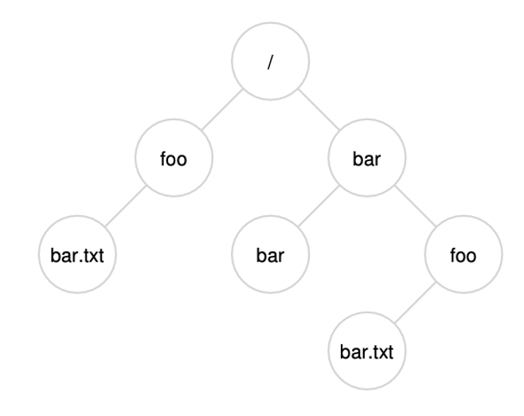{.fragment}
:::
::::

## Directories (cont'd)
:::: {.columns}
::: {.column width="60%"}
- What's with `.` and `..`?
- Special directory entries
  - `.` Refers to itself
  - `..` Refers to the parent directory

:::
::: {.column width="2%"}
:::
::: {.column width="38%"}

:::
::::

## Directory operations
- What operations do we want to support on directories?
- Common operations:
  - `create`, `delete`, `opendir`, `closedir`, `readdir`, `rename`, `link`, `unlink`
- Links can be [hard]{.alert} links or [soft]{.alert} links
  - Who can tell me the difference?
  - How do you create them in Linux?
  - What happens when you delete a hard linked file?
  - What happens when you delete a soft linked file? 

## {background-color="#6E404F"}
::: {.r-fit-text}
What isn't clear?

Comments? Thoughts?
:::

# Linux VFS {background-color="#40666e"}

## Questions to consider
:::{.nonincremental}
- How does Linux support many different file systems (ext4, FAT32, NTFS) on the same machine simultaneously?
- What does the kernel actually track when a process opens a file?
- How do file descriptors relate to the kernel's internal representation of open files?
:::

## Overview
- We want to support many different file systems, often running on the same system
  - E.g. FAT32, NTFS, ext3, ext4, etc.
- How should we accomplish this seamlessly?
  - Virtual File System (VFS)
    - OO approach created by Sun
    - VFS offers generic APIs

## VFS
- System call interface: APIs for user programs
- [VFS]{.alert}: manages the namespace, keeps track of open files, reference counts, file system types, mount points, pathname traversal.
- [File system module]{.alert}: understands how the file system is implemented on the disk. Can fetch and store metadata and data for a file, get directory contents, create and delete files and directories
- [Buffer cache]{.alert}: no understanding of the file system; takes read and write requests for blocks or parts of a block and caches frequently used blocks.
- [Device drivers]{.alert}: the components that actually know how to read and write data to the disk.

## VFS (cont'd)
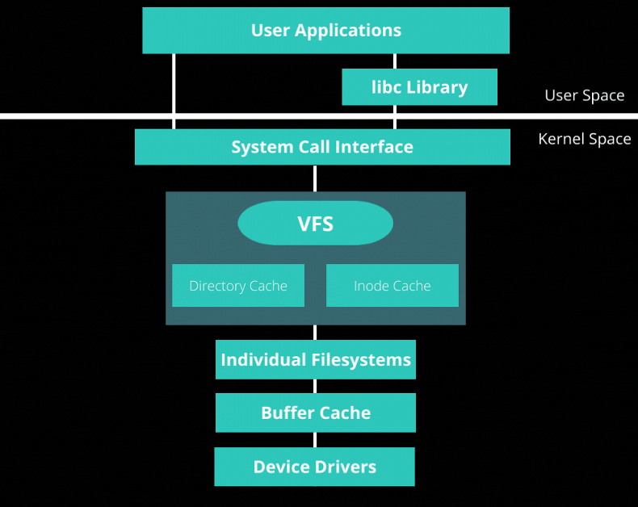

## File descriptors
- When a process calls `open()`, the OS returns a small non-negative integer: a [file descriptor]{.alert} (fd)
- The fd is just an index into the process's [per-process file descriptor table]{.alert} (stored in the PCB)
- Three fds are always pre-opened for every process:
  - `0` → `stdin`, `1` → `stdout`, `2` → `stderr`
- All subsequent file syscalls take the fd as their first argument:
  - `read(fd, buf, n)`, `write(fd, buf, n)`, `close(fd)`, `lseek(fd, offset, whence)`
- Why return an int instead of a pointer?
  - Safety: the process can't dereference or forge a kernel pointer
  - The kernel remains in control of the underlying state

## Open file table
- The per-process fd table doesn't hold file state directly — it points into a system-wide [open file table]{.alert}
- Each entry in the open file table tracks:
  - [Current offset]{.alert} (position for the next read/write)
  - [Access mode]{.alert} (read-only, write-only, read-write, append)
  - [Reference count]{.alert} (how many fd table entries point here)
  - Pointer to the [inode]{.alert} (the actual file metadata + data block pointers)
- Why two separate tables?
  - Two processes independently `open()` the same file → two open file table entries → [independent positions]{.alert}
  - `fork()` copies the fd table, so parent and child [share]{.alert} the same open file table entry → shared position and reference count incremented

## Three-table model
- Per-process [fd table]{.alert} (in PCB): small, just indices
- System-wide [open file table]{.alert}: one entry per `open()` call
- System-wide [inode table]{.alert}: one entry per file, regardless of how many times it's open
- Key insight: the *name* of a file lives in a directory; the *file itself* is the inode

## VFS: Four key abstractions
- [Superblock]{.alert}: one per mounted file system; tracks the file system type, size, status, and other info
- [Inode]{.alert}: one per file; tracks file type, permissions, owner, size, pointers to data blocks, etc.
- [Dentry]{.alert}: one per directory entry; tracks the name and pointer to the inode 
- [File]{.alert}: one per open file; tracks the current position, pointer to the inode, pointer to the dentry, etc.

## {background-color="#6E404F"}
::: {.r-fit-text}
What isn't clear?

Comments? Thoughts?
:::

# File system structures {background-color="#40666e"}
## Questions to consider
:::{.nonincremental}
- How is a disk partitioned and bootstrapped so the OS can find its file systems?
- What on-disk structures are needed to organize files, and what role does each play?
:::

## Disk layout
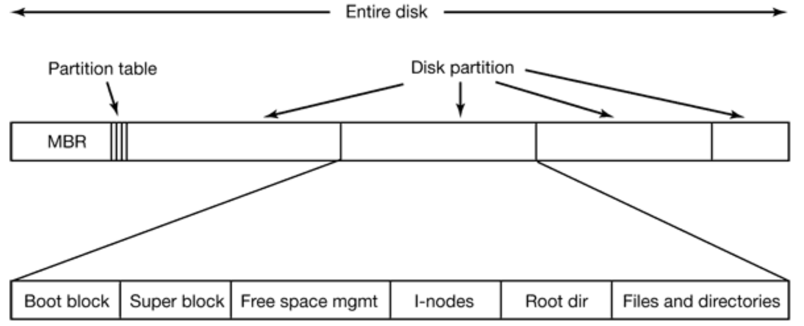

## Disk layout (cont'd)
- [Master Boot Record]{.alert} (MBR)
  - Holds the information necessary to bootstrap the system's file systems
    - Partition table
      - A logical mapping of the mountable file systems available on the device
  - Machine code to necessary to read partition table and active partition
  - By convention, MBR always at sector 0
- BIOS reads MBR, finds active partition, loads its [boot block]{.alert} into memory, and jumps to it
- Boot block contains machine code to bootstrap the OS

## Disk layout (cont'd)
- From here on, file system structures can vary greatly
- We'll start with a very simple example
- Often, two major components: metadata blocks and data blocks
  - [Metadata]{.alert} contains information about the objects in the file system
  - [Data]{.alert} contains the actual information, stored by the user
- Remember: what follows are the **on-disk** structures

## Start with a blank disk
- Divided into blocks, let's say 64 blocks that are 4KB each
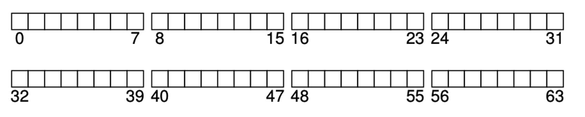

## Data blocks
- We want to make most of the disk available for, you know, storing things
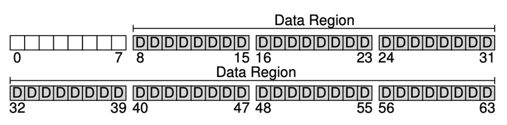

## Metadata blocks
- We need to store metadata about files. Where should that go?
  - A structure called an [inode]{.alert} 
- Where should inodes go?
  - Inode table
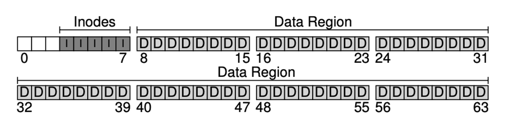

## We need to track used/free blocks
- What's a space-efficient way to track blocks?
  - Bitmaps: 0 = free, 1 = in-use
- We'll use one block for an inode bitmap, one for data
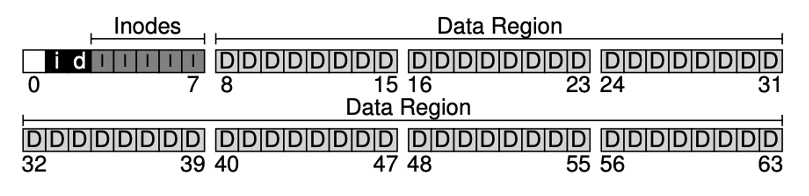

## How do we bootstrap the file system?
- When the system starts, how do we figure out how to do things with this file system?
  - Superblock
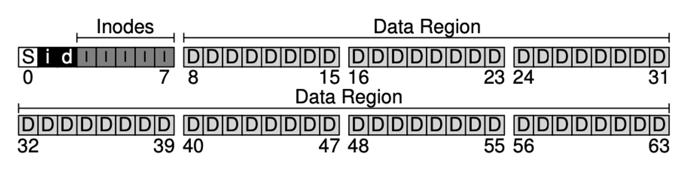

## Superblock
- The superblock contains critical information about the file system, including:
  - File system type (e.g., ext4, FAT32)
  - Total number of used/free blocks
  - Number of inodes
  - Location of the inode table
  - Location of the data blocks
  - Mount status (e.g., clean, dirty)
  - Other file system-specific information (e.g., journaling status, features, etc.)
- Since the superblock is critical for mounting and using the file system, it's typically replicated in multiple locations on disk for redundancy

## {background-color="#6E404F"}
::: {.r-fit-text}
What isn't clear?

Comments? Thoughts?
:::

# Inodes {background-color="#40666e"}
## Questions to consider
:::{.nonincremental}
- What information does an inode store, and why doesn't it include the file name?
- Why can't we just use direct pointers for all files, and how do we solve the problem?
:::

## Inodes
- Each inode tracks metadata about a file, including:
  - Pointers to data blocks associated with the file
  - Reference count (number of directory entries that point to this inode)
  - Permissions (read, write, execute bits)
  - Owner and group IDs
  - File size 
  - Timestamps (creation, modification, access)
  - (most things available from `stat()`)
  - Does **NOT** contain the file name

## Inodes (cont'd)
- Inodes are this non-user-facing number / struct used to reason about files from the OS point of view
- Let's imagine inodes are 256 bytes, so we can store 80 in the example 20KB table
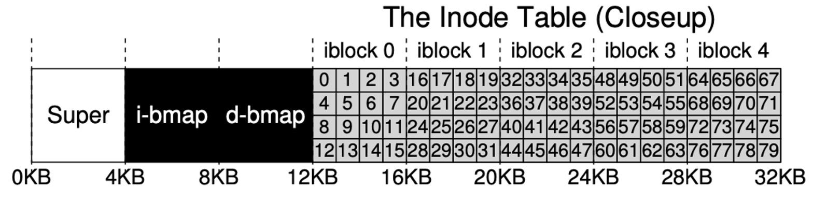

## Inodes (cont'd)
:::: {.columns}
::: {.column width="40%"}
- We use the inode to reference the file's data blocks, which are separate from the inode itself
- How should we track the data blocks for a file?
  - One option: direct pointers
    - Any problems with this approach?
    - It limits the maximum file size
:::
::: {.column width="2%"}
:::
::: {.column width="58%"}
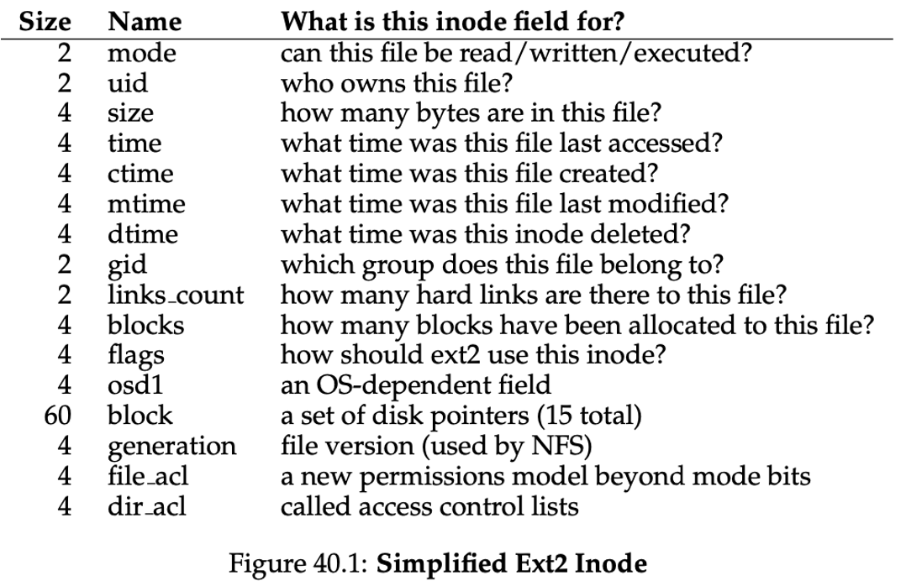
:::
::::

## Inodes (cont'd)
- What should we do for larger files?
- Some small number of [direct pointers]{.alert} (e.g., 12 of the 15). Max file size using direct pointers?
  - $12 * 4KB = 48KB$
- [Indirect pointer]{.alert}: point to a block that contains more pointers, each points to data
  - 4KB block and 32-bit addresses, max file size?
  - $(12 + (4096 / 4)) * 4KB = 4144KB$
- [Double indirect]{.alert}: multi-layered indirect:
  - $(12 + 1024 + 1024*1024) * 4KB = \sim4GB$
- [Triple indirect]{.alert}:
  - $(12 + 1024 + 1024^2 + 1024^3) * 4KB = \sim4TB$

## Inodes (cont'd)
- This multi-level pointer structure allows us to support a wide range of file sizes while keeping the inode size fixed
- A lot of systems use this multi-level index approach
  - Ext2, ext3, others
- Do you see any downsides?
  - It's a bit inefficient to walk down these unbalanced trees. So why is this used?
  - Turns out the vast majority of files are *small*, so optimizing for that case is fine

  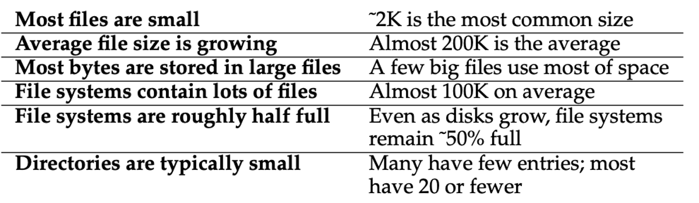{width="50%" .fragment}

## {background-color="#6E404F"}
::: {.r-fit-text}
What isn't clear?

Comments? Thoughts?
:::

