## Admin
:::{.nonincremental}
- Quiz due Friday
- Assignment 4 due next wednesday
- Last lab due next Thursday
:::

# Lookups and Mounting {background-color="#40666e"}
## Questions to consider
:::{.nonincremental}
- How does the OS resolve a pathname like `/home/prs/foo.txt` into the actual file data on disk?
- Why are path lookups expensive, and how does the OS mitigate this cost?
- How does mounting allow different file system types to coexist in a single directory tree?
:::

## Lookups
- How do we find a file given its name?
- We have the directory structure, but how do we actually look up a file?
- We need to traverse the directory tree, starting from the root ("/") and following the path components until we find the target file
- Each directory entry (dentry) contains a name and inode info, so we can use that to navigate through the file system
- The superblock tells us where the root directory is, so we can start there and work our way down the tree
  - Almost always inode 2 is the root directory in UNIX file systems

## Lookups (cont'd)
- When you access a file, the OS needs to perform a lookup to find the corresponding inode
  - Whether it's a relative or absolute path, the OS will recursively traverse the directory structure
  - e.g. the path `/home/prs/foo.txt`
    - Starts at `/`, lookup `home` directory inode, in home looks up `prs` directory inode, etc.

## Lookups (cont'd)
- What is the consequence of this recursive lookup?
  - It can be **expensive**, especially for deep paths or large directories
  - To mitigate this, many file systems implement caching mechanisms (e.g., dentry cache) to speed up lookups for frequently accessed files
    - i.e. a lookup of `./foo` can be resolved using cache only
  - In Linux, the [VFS]{.alert} maintains this cache

## Mounting
- How do we support multiple file systems on the same machine?
- We can use the concept of [mounting]{.alert} to attach different file systems to different points in the directory tree
- For example, we might have an ext4 file system mounted at `/` and a FAT32 file system mounted at `/mnt/usb`
- When we access a file under `/mnt/usb`, the VFS will route the request to the appropriate file system module based on the [mount point]{.alert} and the path being accessed

## Mounting (cont'd)
- VFS handles the interface for lookups
- When a file system is mounted, it registers itself with the VFS
  - In Linux: function pointers associated with common IO operations: e.g. `read()`, `write()`, `lookup()`
- VFS has *in-memory* objects for each of the *on-disk* structures
  - superblock
  - vnode for each open inode
  - dentry object, for cached directory entries
- These abstractions allow many file system implementations to coexist in the same namespace

## {background-color="#6E404F"}
::: {.r-fit-text}
What isn't clear?

Comments? Thoughts?
:::

# File system component implementations {background-color="#40666e"}

## Questions to consider
:::{.nonincremental}
- What data structures can be used to implement directories, and what are the trade-offs of each?
- What does the ext2 superblock contain, and what happens if it gets corrupted?
- How does ext2 use block groups to improve both performance and reliability?
- What are the trade-offs between contiguous, linked, and indexed data block allocation?
:::

## File system component implementations
- What are the objects that need to be implemented?
  - Inodes (already covered)
  - Directories 
  - Superblock
  - Data blocks

## Directory implementation
- Remember, in UNIX/Linux directories are special files, holding a number of tuples
  - What structures make sense to use?
  - Remember, we need to be able to search, add|delete|rename files, etc.

## Directory implementation (cont'd)
- A simple approach: a linear list of `<name, inode>` pairs
  - Simple to implement
  - Downsides?
    - Lookups are O(n) in the number of entries, which can be expensive for large directories
    - This can be slow and we use directory information frequently, any way to speed it up?
      - Caching: many OSes cache recent directory info
      - Sorted lists / binary trees: though keeping things sorted and balanced introduces new complications
- How can we speed up the list?

## Directory implementation (cont'd)
- Hash table
  - Hash the file name to get an index into a hash table, which points to the corresponding inode
  - Pro:
    - No more linear searching
  - Any complications?
    - Collisions (unlikely unless you make terrible choices)
    - Hash tables are a fixed size, if you go beyond the limit, you need to grow the hash table
  - Why not just use a giant hash table by default?
    - Small hash tables can take advantage of hardware caches, and most* directories don't have millions of files in the general case

## Superblock implementation
- Recall the superblock holds critical metadata about the file system
- In ext2, the superblock is a fixed-size structure (1024 bytes) at byte offset 1024 from the start of the partition
  - First 1024 bytes are reserved for the boot block
- Key fields:
  - `s_inodes_count` / `s_blocks_count` — total inodes and blocks
  - `s_free_inodes_count` / `s_free_blocks_count` — free counts
  - `s_log_block_size` — block size as a power of 2 (0→1024, 1→2048, 2→4096)
  - `s_magic` — magic number (`0xEF53`) identifying the FS as ext2

## Superblock implementation (cont'd)
- The superblock also tracks filesystem health:
  - `s_state` — clean vs. dirty (was it unmounted properly?)
  - `s_mnt_count` / `s_max_mnt_count` — triggers `fsck` after N mounts
  - `s_lastcheck` / `s_checkinterval` — time-based `fsck` triggers
- Since the superblock is critical, what happens if it gets corrupted?
  - The entire file system becomes unmountable
  - Solution: ext2 stores redundant copies

## Block groups
- ext2 divides the disk into [block groups]{.alert}
- Each block group contains:
  - A copy of the superblock (or a sparse subset of copies)
  - A group descriptor table
  - Local inode bitmap and data bitmap
  - An inode table (for inodes in this group)
  - Data blocks
- Why organize this way?
  - [Locality]{.alert}: related inodes and their data blocks are physically close on disk, reducing **seek times**
  - [Redundancy]{.alert}: if the primary superblock is corrupted, recovery tools like `e2fsck` can restore it from a backup copy in another block group

## Data block indexing
- How can we allocate files on disk to efficiently use space and access them quickly?
  - There are no perfect answers here

## Data block indexing (cont'd)
- Contiguous allocation: allocate blocks in contiguous runs
- Pros?
  - Excellent sequential performance
  - Easy-ish to implement
- Cons?
  - Remind you of anything? 
    - External fragmentation
    - Finding space for new files
    - May require compaction periodically
  - How do we know the size of a file? It can grow
  - Could use a modified scheme: you get a chunk of space, plus **extents** (another chunk of contiguous space) later if needed

## Data block indexing (cont'd)
- Linked allocation: each block contains a pointer to the next block
- Pros?
  - No fragmentation, since blocks can be anywhere on disk
  - Easy to grow files
- Cons? 
  - Terrible random access performance (need to follow pointers)
  - More overhead per block (need to store pointers)
  - Not great for sequential access either: you can't read ahead easily
  - Unreliable: if a block pointer is corrupted, the rest of the file is lost

## Data block indexing (cont'd)
- Indexed allocation: use an index block that contains pointers to the data blocks
- Pros?
  - Better random access than linked allocation 
  - No fragmentation, since blocks can be anywhere on disk
- Cons?
  - Still more overhead than contiguous (need to store index blocks)
  - Still unreliable: if the index block is corrupted, the entire file is lost
- What if the index block is too small for large files? 
  - Multi-level indexing: direct, single indirect, double indirect, triple indirect (similar to inodes)

## Data block indexing summary
- All methods have pros and cons. How should we choose?
  - We need to know our usage patterns
- Sequential systems shouldn't use the same method as random

## Data block free space management
- How do we track free data blocks?
- Handful of options:
  - Bitmaps
  - Linked lists of free blocks

## Bitmap free space management
- A bitmap is a simple array of bits, where each bit represents a block on disk (0 = free, 1 = in-use)
- Pros?
  - Space-efficient: only 1 bit per block
  - Fast to check for free blocks (can use bitwise operations)
- Cons?
  - Finding contiguous free blocks can be slow (need to scan the bitmap)
  - Can be inefficient for large disks (the bitmap itself can become large)
    - 1TB drive, 4KB blocks = 32MB for a bitmap
    - This will only get more difficult as disk capacities increase

## Linked list free space management
- Another approach is to maintain a linked list of free blocks, where each free block contains a pointer to the next free block
- Pros? 
  - Can be faster to find free blocks, especially if we maintain a free block count or use a free block cache
- Cons?
  - Sequential traversal can be slow, especially if the list is long
  - Poor support for finding contiguous blocks
  - Can lead to fragmentation over time, as free blocks may be scattered across the disk
  - Not great for large disks, as the linked list can become long and slow to traverse

## Data block free space management summary
- Both methods have trade-offs, and the choice depends on the specific requirements of the file system
- Many modern file systems use bitmaps (ext2/3/4, NTFS) for their simplicity and fast bitwise scanning
- For large-scale file systems, more sophisticated structures are used: extent trees (XFS, Btrfs) or B-trees (ZFS) that track runs of free blocks rather than individual ones

## {background-color="#6E404F"}
::: {.r-fit-text}
What isn't clear?

Comments? Thoughts?
:::

# File system consistency {background-color="#40666e"}
## Questions to consider
:::{.nonincremental}
- What can go wrong when a crash interrupts a multi-step file system operation like appending to a file?
- How does `fsck` detect and repair file system inconsistencies, and what are its limitations?
- How does journaling maintain consistency across crashes, and what ordering guarantees matter?
- What is the difference between ordered and journal modes?
:::

## Consistency
- Machines can crash / reboot unexpectedly. 
- Example: bitmap + inode + data block. Append operation results in three writes
  - What outcomes are possible from a crash?

## Consistency (cont'd)
- One operation succeeds
  - Just inode is updated 
    - Pointing to garbage
    - Inconsistent with bitmap
  - Just the bitmap is updated
    - Inconsistent with inode
    - If we do nothing, we have a space leak
  - Just the data block is written (no inconsistency for FS, still bad)

## Consistency (cont'd)
- Two operations succeed
  - Inode and data, not bitmap
    - Inconsistent FS
  - Bitmap and data, not inode
    - Inconsistent and we have no idea who (inode) owns the data
  - Bitmap + inode done, not data
    - Big problem. FS is consistent, but data is garbage

## Consistency (cont'd)
- What should we do?
 - Atomicity isn't an option, disks do one thing at a time
- We can allow things to fail, and try to recover from inconsistencies after the fact
- We can use a journal

## Consistency checking
- `fsck`: file system consistency check. Uses up to six passes:
  - Pass 1: scan superblock and all inodes
    - for each inode, ensure metadata makes sense (valid permissions, sensible/valid block numbers)
  - Pass 2 & 3: check directories
    - Do `.` and `..` create a cycle-less namespace?
    - Orphaned directories are placed in `lost+found`
  - Pass 4: Check ref counts
  - Pass 5: check bitmaps
    - Do the in-use bitmaps match the current inode, block state?
  - Pass 6: check sectors (optional)

## Consistency checking (cont'd)
- `fsck` is a powerful tool, but
  - It requires the file system to be unmounted, which can lead to downtime
  - This is a massive operation, can take hours... Should we really take this extreme approach for a potentially small issue?
  - It doesn't fix all problems (bitmap and inode are consistent but point to garbage)
  - Allows things to break then tries to repair
- There has to be a better way to maintain consistency in the first place, which leads us to [journaling]{.alert}

## Journaling
- Like any hard systems problem, we'll steal ideas from others (in this case databases)
- The idea is to write an operation's intent to a journal before performing the actual operation
- If the system crashes, we can replay the journal to complete any operations that were in-flight
- Journaling can be implemented in different ways:
  - [Ordered mode]{.alert}: only journal metadata changes (e.g., inode updates, bitmap changes)
  - [Journal mode]{.alert}: both metadata and data are written to the journal

## Example: ext3
- Ext2 + journaling
  - Organized into block groups
  - Groups sized equal to one or more disk tracks
  - Each group contains
    - a copy of the superblock (although not all are current)
    - a group description (block group metadata)
      - block number of blocks; allocation bitmap
      - block number of inodes; allocation bitmap
      - number of free blocks; inodes and directories in group
    - Inodes
    - Data blocks

## Example: ext3 (cont'd)
- ext3 inodes use a multi-level index
  - 12 direct, 1 single indirect, 1 double indirect and 1 triple indirect
    - 4KB blocks? 48K, 4MB, 4GB, 4TB
- Attempts to allocate related blocks near each other, near their inodes (within a group): within a cylinder group or in nearby cylinder groups
  - All blocks of a file accessed in one track access (ideally)
- Fixed number of inodes per group

## Ext3 journaling
- Transaction begin and end markers in the journal, plus actual data to be written
- Naive order of operations:
  - Write journal entry 
  - Write to disk
- What happens if the system crashes in the middle of the journal write (say, Db is not written)?
  - Could write garbage when replaying the transaction upon boot
  - Now what?

## Ext3 journaling (cont'd)
- Ext3 uses ordered mode journaling, which means that only metadata changes are journaled, and data blocks are written directly to their final location on disk
  - We have to be *careful* about the order of operations to maintain consistency
- We need to break the transaction into multiple steps, and write them in a specific order to ensure consistency
  - Write data blocks to their [final disk location]{.alert} (never to the journal)
  - Write metadata blocks to the journal
  - Write transaction end marker to journal (MUST be last, known as a transaction [commit]{.alert})
  - Write (checkpoint) metadata blocks to their final disk location
- The key invariant: data is on disk *before* the journal commit that makes the new metadata visible

## Another example: Log-structure File System
- Assumption: memory keeps growing, so writes are most important since reads will be done from memory
- Data are written to circular log, never overwriting data
- Metadata and data are not in fixed positions
- FS is occasionally checkpointed
- Side bonus: implicit versioning... easy to look back to older version of files

## Log-structure File System (cont'd)
- Pros?
  - Fast writes, since we just append to the log
  - Crash recovery reads the checkpoint region to restore a consistent inode map, then scans forward in the log for any newer inode map segments written after the checkpoint
- Cons?
  - Reads can be slow, since data may be scattered across the log
  - Space management can be complex, we need garbage collection to reclaim space from deleted files and old versions
  - Not widely used in practice, but the ideas have influenced modern file systems like `ZFS` and `Btrfs`, which use copy-on-write techniques to achieve similar benefits

## Copy-on-write file systems
- Traditional write:
  - `[read block] → [modify in memory] → [write back to same disk block]`
- Copy-on-write (COW) write:
  - `[read block] → [modify in memory] → [write to new disk block] → [update metadata to point to new block]`
- Pros?
  - Crash consistency: since we never overwrite existing data, we can always recover to a consistent state
  - Snapshots and versioning: we can easily create snapshots by just keeping references to old blocks

## {background-color="#6E404F"}
::: {.r-fit-text}
What isn't clear?

Comments? Thoughts?
:::

# Storage basics {background-color="#40666e"}
## Questions to consider
:::{.nonincremental}
- What are the three components of HDD access time, and which dominates?
- How does RPM affect average rotational latency?
:::

## Performance trends
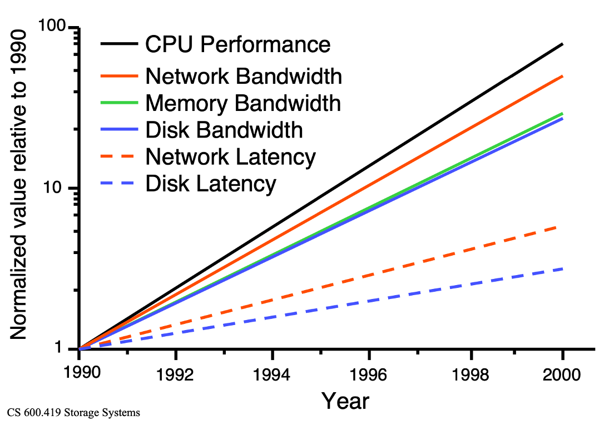

## Consequence: storage performance dominates (in a bad way)
- Assume 50 seconds CPU & 50 seconds I/O
  - 1998 - 1999
    - CPU improves by: $N = 50/25 = 2$
    - Program performance improves by: $N = 100/75 = 1.33$
  - 1999 - 2000
    - CPU performance - factor of 2
    - Program performance $N = 75/62.5=1.2$
  - 2000 - 2001
    - CPU performance - factor of 2
    - Program performance $N = 62.5/56.5 = 1.11$

## HDDs
:::: {.columns}
::: {.column width="50%"}
- Yes, they're still important / around
- Far more cost effective than SSDs
- Sector: (512 bytes) smallest amount of IO you can do to an HDD
- Tracks: 256KB-1MB in size
:::
::: {.column width="2%"}
:::
::: {.column width="48%"}
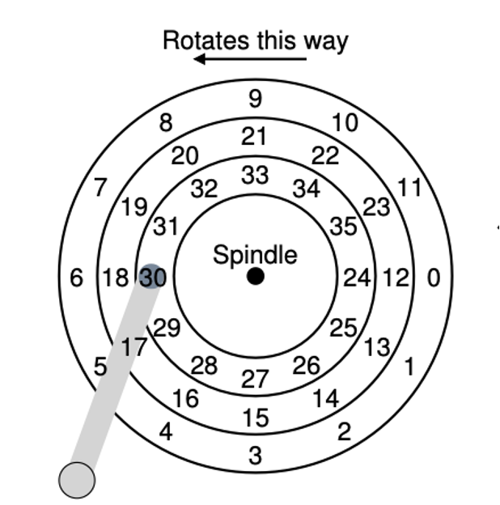
:::
::::

## HDDs (cont'd)
:::: {.columns}
::: {.column width="50%"}
- Actual drives have many platters, are double-sided
- Millions of tracks
- Performance factors?
  - Seek (moving the arm to position the head over the correct sector)
  - Rotation (RPMs)
  - Transfer (time to read/write from the head)
- Which do you think is most burdensome / costly?
:::
::: {.column width="2%"}
:::
::: {.column width="48%"}
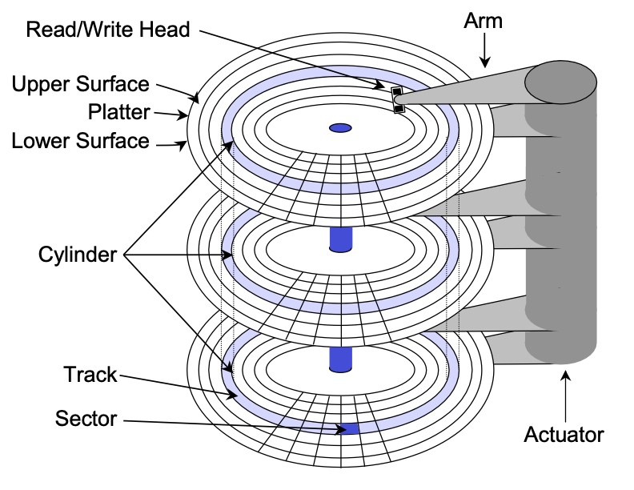
:::
::::

## Seek time
- Seek: accelerate, coast, settle
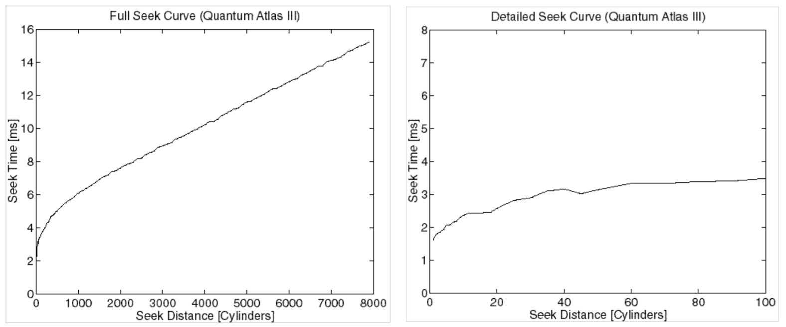

## Rotation time
- a function of RPM; average rot. lat. ½ revolution
  - e.g. 7200RPM = 8.33ms per rotation 
    - avg = 4.16ms
- Common HDD speeds:
  - 5400 (yikes, good for cold storage)
  - 7200 (decent middle ground)
  - 10K, 15K (good for a lot of random accesses); use case?
    - DBs 

## Transfer time
- simple case (all data in one track): 
  - `sectors desired * time for revolution / sectors per track`
- complex case (mult. tracks): above + ? (seeks, track & cyl. switches)

## Where does the time go?
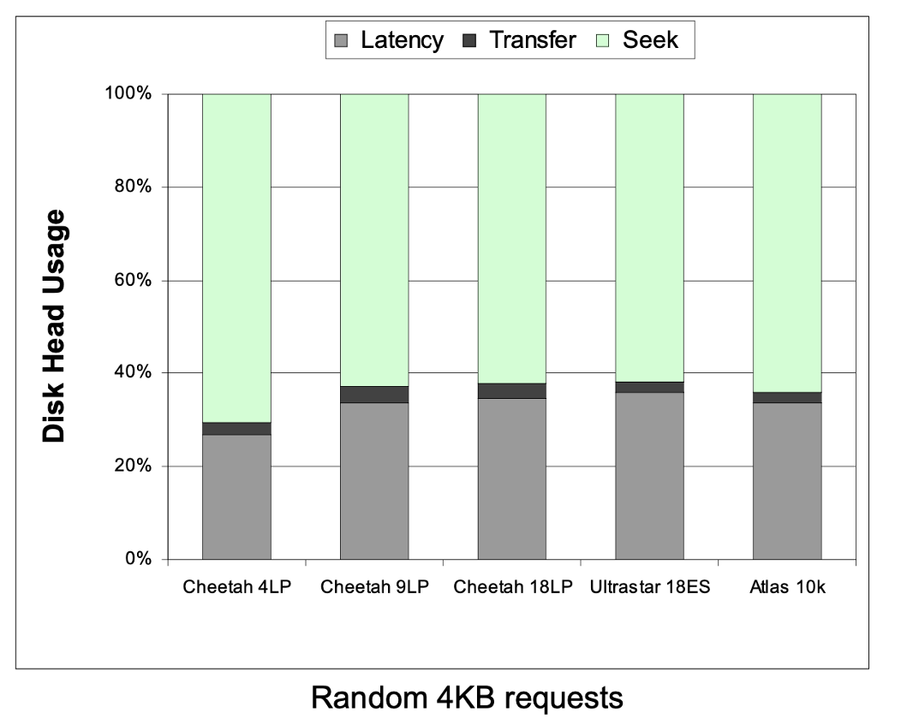

## Where does the time go? It depends.
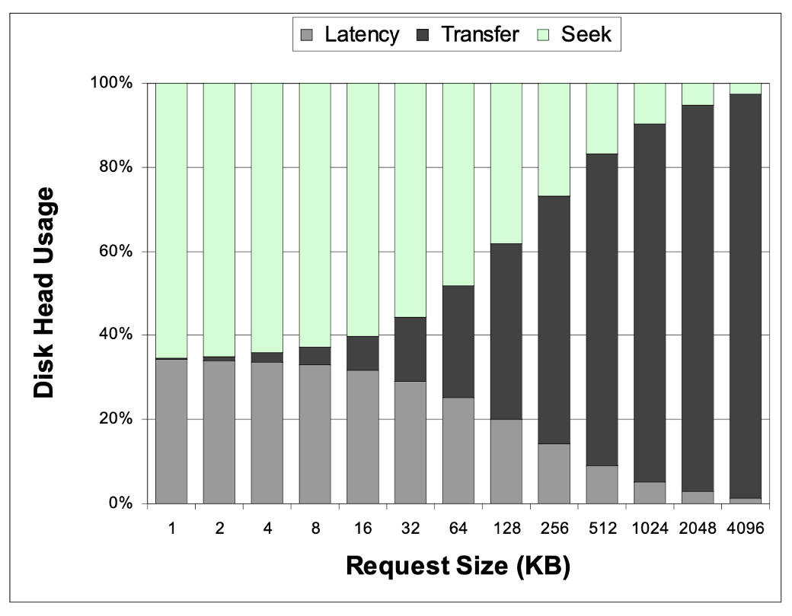

## {background-color="#6E404F"}
::: {.r-fit-text}
What isn't clear?

Comments? Thoughts?
:::

# HDD organization {background-color="#40666e"}
## Questions to consider
:::{.nonincremental}
- What is track skew, and why does it improve sequential read performance across cylinders?
- Why do outer tracks hold more data than inner tracks on a constant-RPM drive, and how does zoning address this?
- When a sector goes bad, what are the two ways a drive can handle it, and what is the trade-off?
:::

## Simple organization
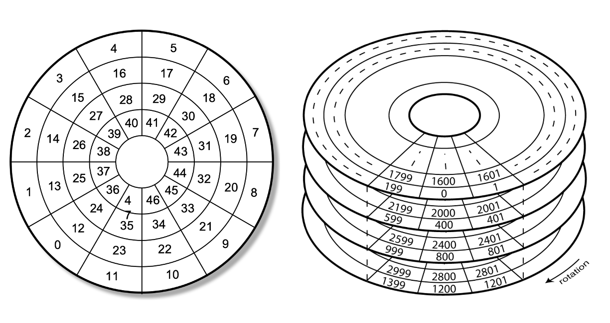

## Simple organization (cont'd)
:::: {.columns}
::: {.column width="50%"}
- What's presented by the disk drive: a linear array of sectors
  - This is a logical abstraction
- Drive must map logical blocks to physical blocks
:::
::: {.column width="2%"}
:::
::: {.column width="48%"}

:::
::::

## Complication: skew
:::: {.columns}
::: {.column width="60%"}
- Sequential reads / write are ideal
- Unfortunately, seeks exist, and sector sequences can cross cylinders / tracks
- E.g., if you are reading sectors 9-12 on the disk you need to seek to a new cylinder
  - What downside does this present?
    - By the time you seek, sector 12 has already spun past the head, you need to wait for it to rotate back around 

:::
::: {.column width="2%"}
:::
::: {.column width="38%"}
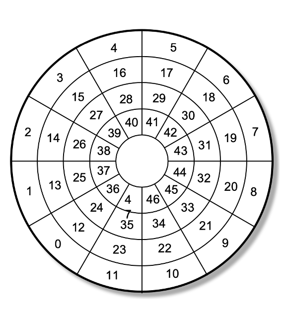
:::
::::

## Complication: skew (cont'd)
:::: {.columns}
::: {.column width="60%"}
- What should we do?
- Reorganize where sectors are located on the physical device
  - Requires tuning based on the specific device characteristics, in this example it's 2 blocks off (to go from sector 23 to sector 24)

:::
::: {.column width="2%"}
:::
::: {.column width="38%"}
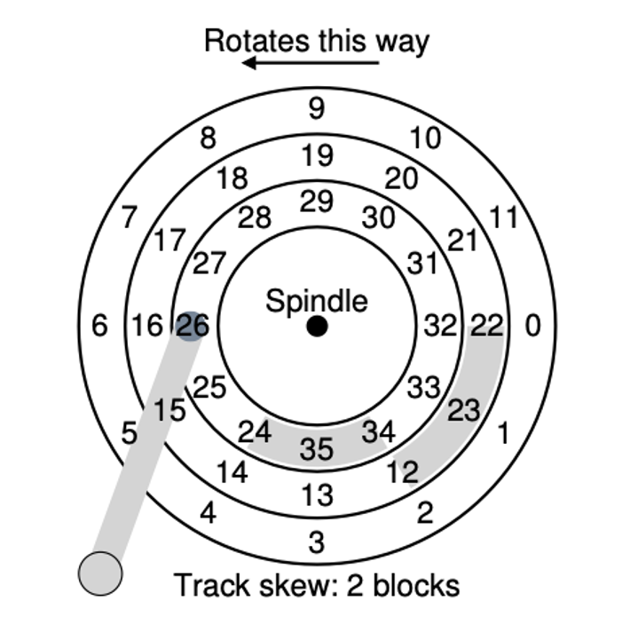{.fragment}
:::
::::

## Complication: zones
- Linear velocity vs. angular velocity
- We talk about drives in terms of constant RPM: what is the consequence of this for tracks?
  - Outer tracks have more space to put data
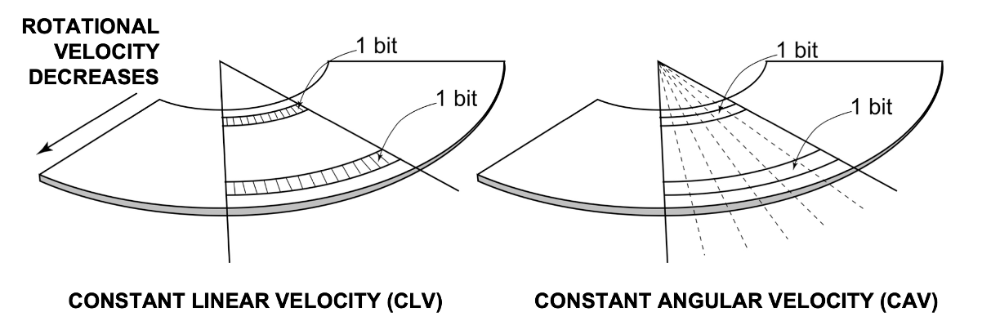{.fragment}

## Complication: zones (cont'd)
:::: {.columns}
::: {.column width="60%"}
- What should we do?
- We could slow the rotation on outer tracks
  - Some older systems did this
- Option 2: (common) 
  - Place more sectors per zone on outer tracks
  - Complicates logic

:::
::: {.column width="2%"}
:::
::: {.column width="38%"}
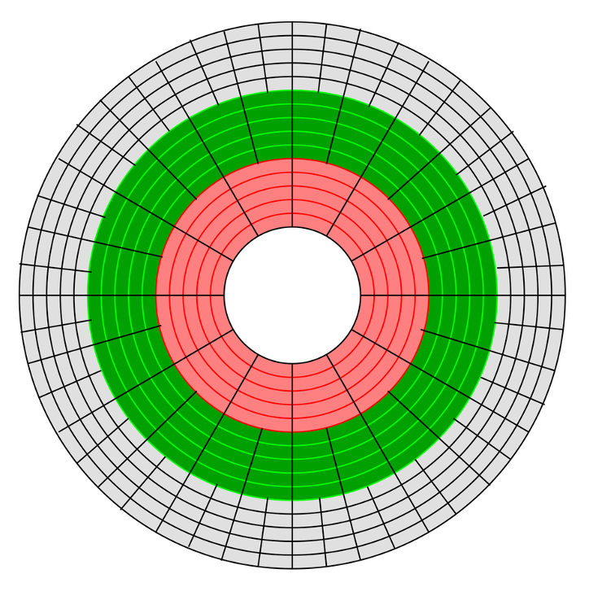{.fragment}
:::
::::

## Complication: defects
- Over time, portions of media become unusable (e.g. fail to hold charge, exhibit many errors);
- How should we handle a defect? 
  - We keep additional physical space for "spares" (both tracks and sectors)

## Complication: defects (cont'd)
:::: {.columns}
::: {.column width="60%"}
- How should we handle a defect? 
- [Remapping]{.alert}: move the sector to a location in the reserved spare pool 
- Ongoing process, taken care of by drive firmware
- Do you see any downsides?
  - Sequential access is now broken
:::
::: {.column width="2%"}
:::
::: {.column width="38%"}
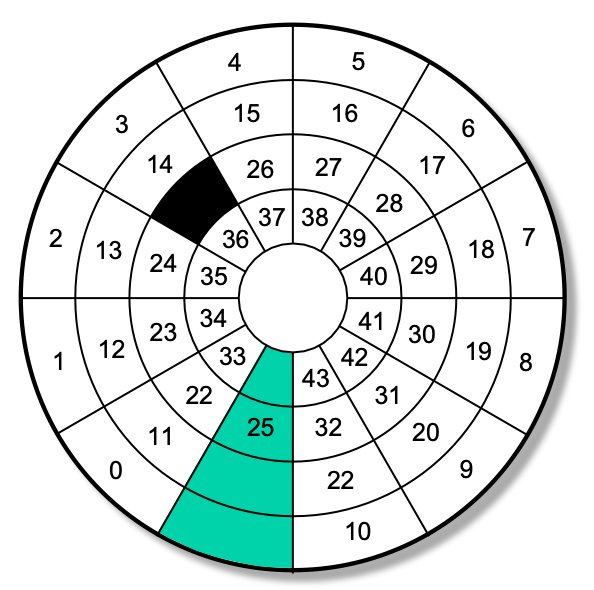{.fragment}
:::
::::

## Complication: defects (cont'd)
:::: {.columns}
::: {.column width="60%"}
- What else could we do?
  - Move everything to maintain sequential sectors (known as [slipping]{.alert})
    - This really only works on a fresh drive formatting: hard to do live
  - Other approaches?
    - Error Correcting Codes (ECC)
      - If you're curious most HDDs use Reed-Solomon

:::
::: {.column width="2%"}
:::
::: {.column width="38%"}
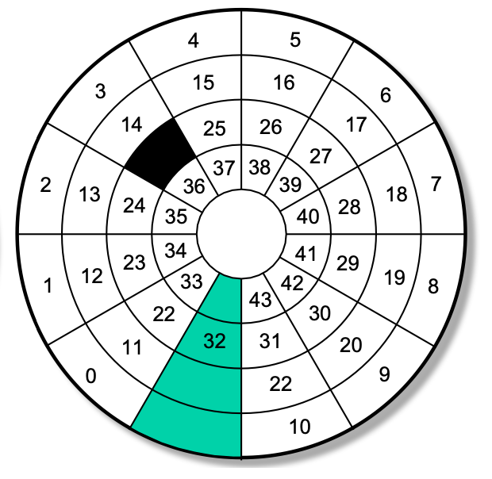{.fragment}
:::
::::

## HDD organization summary
- Luckily, the OS no longer needs to care about most of these details: taken care of by firmware on the drive itself
- We'll return to some gory details about disks in a bit (RAID), but first, disk scheduling

## {background-color="#6E404F"}
::: {.r-fit-text}
What isn't clear?

Comments? Thoughts?
:::

# Disk scheduling {background-color="#40666e"}
## Questions to consider
:::{.nonincremental}
- Why does the OS (or disk controller) bother reordering I/O requests rather than just serving them in arrival order?
- What problem does SSTF solve compared to FCFS, and what new problem does it introduce?
- How does SCAN (elevator) avoid the starvation problem of SSTF, and why is it unfair to requests that just arrived behind the head?
- What is the difference between SCAN and LOOK, and why is LOOK generally preferred?
:::

## Disk scheduling
- We know that disk performance is punitive
- OSes typically have many processes issuing reads/writes; this gives us an opportunity to implement some scheduling disciplines on the IO queues that build up
- Note: these algos used to be in the OS when it directly controlled the device
  - Drives have their own disk controllers now, which run the algos

## Disk scheduling (cont'd)
- Remember the costs associated with IO:
  - Seek, rotation, transfer (seek dominates)
- Something to consider: I/O is bursty and stochastic
  - Bunches of requests will arrive with small inter-arrival times
  - This leads to I/O request queues sometimes growing quite large
  - … Followed by lengthy inter-arrival times (time to catch up, leads to idle eventually)
  - Very difficult to predict what's going to be requested, and when

## Disk scheduling (cont'd)
- Scheduling Goal: how can we efficiently (i.e., order )service requests?
- Simplest? [FCFS]{.alert} 
  - Pros?
    - Nothing done to optimize seek, but fair
    - No starving
  - Cons?
    - No attempt to optimize seek time
    - Spoiler: almost always sub-optimal 

## FCFS example
:::{.noincremental}
- Let's use an example: disk has 200 cylinders; drive head is at cylinder 50; queue of pending requests:
  - 82, 170, 43, 140, 24, 16, 190
:::

:::{.notes}
FCFS: 
170-50 = 120
170-43 = 127
140-43 = 97
140-16 = 124
190-16 = 174

642 total
:::

## Disk scheduling (cont'd)
- FCFS doesn't do anything to minimize costly seeks. What else should we try?
- Shortest Seek Time First ([SSTF]{.alert})
  - Service requests with the shortest seek time from current head location
- Pros?
  - Optimal in terms of response time
- Cons?
  - Can lead to starvation if requests continue to arrive (request far from the current position may never get serviced)

## SSTF example
:::{.noincremental}
- Let's use an example: disk has 200 cylinders; drive head is at cylinder 50; queue of pending requests:
  - 82, 170, 43, 140, 24, 16, 190
:::

:::{.notes}
SSTF: 
(50-43)+
(43-24)+
(24-16)+
(82-16)+
(140-82)+
(170-140)+
(190-170) 
=208 
:::

## Disk scheduling (cont'd)
- SSTF minimizes seek time, but can lead to starvation. Can we do better?
- [SCAN]{.alert} (aka Elevator algorithm)
  - Move the head in one direction, servicing requests as it goes, until it reaches the end of the disk, then reverse direction and service requests on the way back
- Pros?
  - Solves starvation issue of SSTF
  - Simple
- Cons?
  - Long waits for those that just arrived behind the r/w head 

## Disk scheduling (cont'd)
- SCAN favors requests in the middle: leads to non-uniform waits for a uniform request distribution. What should we do?
- [C-SCAN]{.alert}
  - Like SCAN, but don't reverse. Jump back to the other side of the disk
  - Pros?
    - Same as SCAN, plus more fair 
  - Cons?
    - More seeks

## Disk scheduling (cont'd)
- SCAN and C-SCAN are somewhat wasteful in terms of movement (they both go to the extremes of the disk, regardless of actual requests). Fix?
- [LOOK]{.alert} / [C-LOOK]{.alert}
   - Like SCAN and C-SCAN, but your boundaries are the actual requests
    - True elevator scheduling, usually what people mean when they say SCAN
  - Pros?
    - Less wasted movement
  - Cons?
    - More complex (not terrible, but more than simply sweeping across the disk)

## Disk scheduling summary
- Which should we choose?
- Generally speaking, SCAN family is used
  - Good for heavy disk loads, avoid starvation
  - What if you had a system where the average queue length was 1?
- Linux has a [deadline scheduler]{.alert}
  - Separate read and write queues (prioritize reads as processes are more likely to block on read vs write)
  - Ordered queues: so they end up being serviced in a SCAN-like order
  - Also FCFS queues for both for bookkeeping
    - After a batch of actions, check to see if there are any in the FCFS queue that has aged beyond some threshold

## {background-color="#6E404F"}
::: {.r-fit-text}
What isn't clear?

Comments? Thoughts?
:::