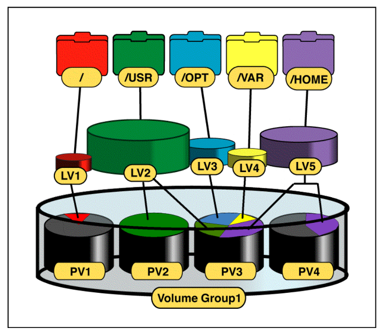
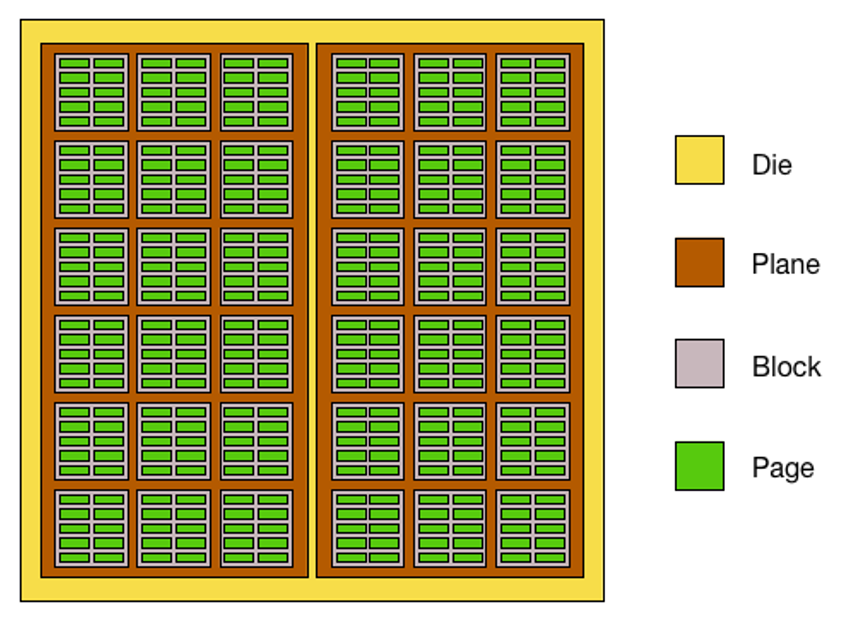
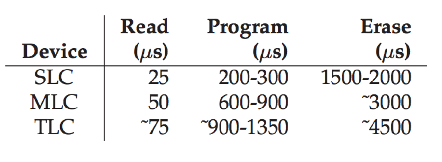

## Admin
:::{.nonincremental}
- Don't forget the last quiz
:::

## Disk scheduling (cont'd)
- SSTF minimizes seek time, but can lead to starvation. Can we do better?
- [SCAN]{.alert} (aka Elevator algorithm)
  - Move the head in one direction, servicing requests as it goes, until it reaches the end of the disk, then reverse direction and service requests on the way back
- Pros?
  - Solves starvation issue of SSTF
  - Simple
- Cons?
  - Long waits for those that just arrived behind the r/w head 

## SCAN example
:::{.noincremental}
- Let's use an example: disk has 200 cylinders; drive head is at cylinder 50; queue of pending requests:
  - 82, 170, 43, 140, 24, 16, 190
:::

::: {.notes}
(199-50) + (199-16) = 332
:::

## Disk scheduling (cont'd)
- SCAN favors requests in the middle: leads to non-uniform waits for a uniform request distribution. What should we do?
- [C-SCAN]{.alert}
  - Like SCAN, but don't reverse. Jump back to the other side of the disk
  - Pros?
    - Same as SCAN, plus more fair 
  - Cons?
    - More seeks

::: {.notes}
CSCAN: (199-50) + (199-0) + (43-0) = 391
:::

## Disk scheduling (cont'd)
- SCAN and C-SCAN are somewhat wasteful in terms of movement (they both go to the extremes of the disk, regardless of actual requests). Fix?
- [LOOK]{.alert} / [C-LOOK]{.alert}
   - Like SCAN and C-SCAN, but your boundaries are the actual requests
    - True elevator scheduling, usually what people mean when they say SCAN
  - Pros?
    - Less wasted movement
  - Cons?
    - More complex (not terrible, but more than simply sweeping across the disk)

## Disk scheduling summary
- Which should we choose?
- Generally speaking, SCAN family is used
  - Good for heavy disk loads, avoid starvation
  - What if you had a system where the average queue length was 1?
- Linux has a [deadline scheduler]{.alert}
  - Separate read and write queues (prioritize reads as processes are more likely to block on read vs write)
  - Ordered queues: so they end up being serviced in a SCAN-like order
  - Also FCFS queues for both for bookkeeping
    - After a batch of actions, check to see if there are any in the FCFS queue that has aged beyond some threshold

## {background-color="#6E404F"}
::: {.r-fit-text}
What isn't clear?

Comments? Thoughts?
:::

# Storage organization {background-color="#40666e"}
## Questions to consider
:::{.nonincremental}
- Why is a single disk insufficient for many modern applications, and what two software/hardware abstractions help organize multiple disks?
- What is a RAID stripe, and how does stripe size affect throughput and internal fragmentation?
- How does RAID 0 differ from RAID 1 in terms of performance and redundancy?
- How does XOR parity allow RAID 4/5 to reconstruct data after a single disk failure?
- What is the "small write problem" in RAID 5, and why does it occur?
:::

## Storage organization
- Single disks neither have the capacity, responsiveness, throughput or reliability to be supportive of many applications we desire
  - High-bandwidth applications: multi-media, scientific computing
  - High-capacity: "big data" applications
  - High-availability: any online service
- We're limited by physics to increase capacity: bit-densities are approaching theoretical limits
- Form factor and energy limit the physical size

## Storage organization (cont'd)
- What should we do?
  - Add more disks
- Q: How do we organize multiple drives into a single logical unit of storage?
  - LVM
  - RAID

## LVM
:::: {.columns}
::: {.column width="50%"}
- Logical Volume Manager: a way of organizing/abstracting multiple block devices into a single logical unit of storage
- A [software]{.alert} translation layer
- Can provide additional features, like: encryption, snapshots, redundancy, hot-swapping, resizing
:::
::: {.column width="2%"}
:::
::: {.column width="48%"}

:::
::::

## RAID
- [Redundant Array of Independent Disks]{.alert}: another type of volume manager
- Often a physical organization of disks, and a hardware controller, providing a single logical view of all disks
  - (Although software controllers exist)
- Can provide: high throughput, parallel I/O, reliability and transparent management

## RAID (cont'd)
- Consider Mean-time-to-failure (MTTF)
  - e.g., 750,000 hours for a single disk
  - A data center has 1,000,000 disks
  - 1 disk failure every .75 hours (45 minutes)
- RAID gives us a way to tolerate and recover from these failures gracefully

## RAID terminology
- [Stripe]{.alert}: a set of blocks across multiple disks that are accessed together
  - How does stripe size impact system characteristics?
    - Smaller means more flexibility in size of data stored (reduced internal fragmentation); decreased maximum throughput
    - Larger means high throughput; higher internal fragmentation

- [Mirroring]{.alert}: storing identical data on multiple disks for redundancy
  - Reads are faster (can read from either disk), writes are slower (need to write to both disks)
  - Recovering from a failure is effectively instant: just read from the surviving disk
- [Parity]{.alert}: storing information that can be used to reconstruct data in case of a disk failure

## RAID levels - RAID 0
- [RAID 0]{.alert}: striping without redundancy
- logically, it just looks like one large disk
  - e.g., Two 1TB drives becomes one 2TB drive
- Pros?
  - [High Performance]{.alert}: Data is split across multiple disks, allowing for faster read and write speeds.
  - [Full Capacity Utilization]{.alert}: All disk space is used for storage, with no redundancy overhead.
- Cons?
  - [No Redundancy]{.alert}: If one disk fails, all data is lost.

## RAID levels - RAID 1
- [RAID 1]{.alert}: mirroring
- Two identical RAID sets (mirror copy of each disk)
- Individual drives within a RAID set can fail, so long as their logical counterpart survives
- Reads can be serviced by either set (e.g. whichever responds first)
- Pros?
  - [High Redundancy]{.alert}: Data is mirrored across two disks, providing a complete backup.
  - [Improved Read Performance]{.alert}: Read operations can be faster as data can be read from either disk.
- Cons?
  - [Storage Efficiency]{.alert}: Only half of the total disk space is usable, as the other half is used for mirroring.

## RAID levels - RAID 2-4
- Designate a disk as a parity disk; parity being encoded data for redundancy
  - [RAID 2]{.alert}: bit-level striping with dedicated Hamming code parity
  - [RAID 3]{.alert}: byte-level striping with dedicated parity disk
  - [RAID 4]{.alert}: block-level striping with dedicated parity disk
- Many different encoding schemes; here's a simple one:
  - A ⊕ B ⊕ C = P
  - A dies; P ⊕ B ⊕ C = A
  - All have a *write bottleneck*: only as fast as the parity drive

## RAID 4
- Pros?
  - [Good Read Performance]{.alert}: Similar to RAID 0, data is striped across disks, improving read speeds.
  - [Parity for Redundancy]{.alert}: A dedicated parity disk provides data protection in case of a single disk failure. But the overhead of parity is only 1 disk, so more efficient than RAID 1
- Cons?
  - [Write Bottleneck]{.alert}: The dedicated parity disk can become a bottleneck during write operations.
  - [Single Point of Failure]{.alert}: If the parity disk fails, the entire array is at risk.

## RAID levels - RAID 5
- [RAID 5]{.alert}: block-level striping with distributed parity
- Like RAID 4, but with parity distributed among all disks
- only supports a single drive failure, but …
- … All drives perform in reads and writes
- Best small read, large read, large write performance
  - TERRIBLE small write performance
  - [Small write problem]{.alert}: small-writes incur a lot of I/O; e.g., a small update to a large stripe
  - Entire stripe read in, modified, new parity computed, written back out

## RAID 5
- Pros?
  - [Balanced Performance]{.alert}: Offers good read and write performance with data and parity distributed across all disks.
    - Though this depends on the workload: small writes are very bad, large writes are good
  - [Efficient Storage]{.alert}: Only one disk's worth of space is used for parity, providing better storage efficiency than RAID 1.
- Cons?
  - [Rebuild Time]{.alert}: Rebuilding the array after a disk failure can be time-consuming and impacts performance.
  - [Write Penalty]{.alert}: Write operations (small writes are the worst) are slower due to the need to update parity information.

## Additional RAID levels
- [RAID 6]{.alert}: block-level striping with double distributed parity (can tolerate two disk failures)
- [RAID 10]{.alert}: a combination of RAID 1 and RAID 0 (striping + mirroring)
- Many other levels and variations exist, each with different trade-offs in terms of performance, redundancy, and storage efficiency
  - Levels have become marketing tools, higher levels are typically some combination (often nested) of those we've talked about
    - e.g., [RAID 50]{.alert} (striping across multiple RAID 5 sets), [RAID 60]{.alert} (striping across multiple RAID 6 sets), etc.
- [Hot-spares]{.alert}: a drive in a RAID group that is blank and inactive.
Can be used to immediately rebuild a RAID should a single drive fail without waiting for humans

## Choosing a RAID level
- Depends on your needs and constraints:
  - Performance requirements (read vs write, small vs large)
  - Redundancy needs (tolerance for disk failures)
  - Storage efficiency (how much usable space do you need?)
  - Budget (cost of additional disks for redundancy)
- For example:
  - RAID 0 for high performance with no redundancy (e.g., gaming)
  - RAID 1 for critical data that requires high redundancy (e.g., financial records)
  - RAID 5 for a balance of performance and redundancy (e.g., general-purpose servers where a long rebuild time is acceptable)
  - RAID 6 for environments where data integrity is paramount and multiple disk failures are a concern (e.g., archival storage)

## {background-color="#6E404F"}
::: {.r-fit-text}
What isn't clear?

Comments? Thoughts?
:::

# SSDs {background-color="#40666e"}
## Questions to consider
:::{.nonincremental}
- What are the three levels of NAND flash organization, and what is the smallest unit of read/write vs. erase?
- Why can't an SSD overwrite a page in place, and what sequence of operations is required to update data?
- What is write amplification, and why does it occur in NAND flash?
- What is wear leveling, and why is it necessary for SSD longevity?
- What does the Flash Translation Layer (FTL) do, and why does the OS need it?
:::

## SSDs: NAND Flash Basics
:::: {.columns}
::: {.column width="50%"}
- SSDs use NAND flash memory, which is organized into planes, blocks, and pages
  - Plane: a collection of blocks that can be accessed in parallel
  - Block: a collection of pages (e.g., 128-256 pages per block)
  - Page: the smallest unit of read/write (e.g., 4KB-16KB)
:::
::: {.column width="2%"}
:::
::: {.column width="48%"}

:::
::::

## SSDs: Storing bits
- Single-Level Cell (SLC): 1 bit per cell, more reliable, faster, but more expensive
  - Enterprise applications, high-end consumer devices
  - 50,000-100,000 erase/write cycles
- Multi-Level Cell (MLC): 2 bits per cell, less reliable, slower, cheaper
  - Mainstream consumer devices
  - 3,000-10,000 erase/write cycles
- Triple-Level Cell (TLC): 3 bits per cell, even slower and cheaper
  - Budget consumer devices
  - 1,000-3,000 erase/write cycles
- Quad-Level Cell (QLC): 4 bits per cell, slowest, cheapest
  - Entry-level consumer devices
  - 100-1,000 erase/write cycles

## NAND rules
- Always [read]{.alert} an entire page (e.g., 4KB-16KB)
- Always [write]{.alert} an entire page (To change single byte, need to write entire page)
- Pages cannot be overwritten in place
  - Page can only be written once after an erase
  - An update requires:
    - Read the page into memory, modify, write the modified page to a new location
    - Mark the old page as invalid
- [Erase]{.alert} is done at the block level (e.g., 128-256 pages)
  - To erase a block, all pages in the block must be erased together

## Flash operations

- Read (Page)
  - Read any page in device
  - Fast - 10s of microseconds, irrespective of page number
- Erase (Block)
  - To write a page, the entire block has to be erased: content destroyed
  - every bit changed to 1.
  - Implication: all data needs to be copied safely before erase
  - [Slow]{.alert}: few millisecs to complete
- Program (a.k.a. write) (Page)
  - Can write to a page after block erase
  - [Fast(er)]{.alert} - 100s of microseconds

## SSDs: Performance characteristics

## SSD challenges
- Flash memory is written in pages, erased in blocks
  - [Write amplification]{.alert}: due to the need to erase blocks before writing, the actual amount of data written to the flash can be much larger than the amount of data intended to be written by the host
    - e.g., a single byte update can trigger a read-modify-write cycle for an entire block
  - [Garbage collection]{.alert}: the process of reclaiming space from invalid pages, which can impact performance if not managed properly
- Flash memory wears out after a certain number of program/erase cycles, leading to potential data loss and reduced lifespan
  - [Wear leveling]{.alert}: to prevent premature failure of flash cells, data must be distributed evenly across the flash memory

## SSDs: Flash Translation Layer (FTL)
- The OS cannot deal with all of this complexity. The [FTL]{.alert} is a layer of software/firmware that manages everything related to flash memory, presenting a simple block device interface to the OS
- Responsibilities of the FTL:
  - Address mapping: translating LBAs to PBAs
  - Wear leveling: ensuring even distribution of writes across the flash memory
  - Garbage collection: reclaiming space from invalid pages
  - Bad block management: handling blocks that have worn out or are defective
- The FTL is critical for the performance and longevity of an SSD, as it abstracts away the complexities of flash memory management from the host system

## {background-color="#6E404F"}
::: {.r-fit-text}
What isn't clear?

Comments? Thoughts?
:::

## This is the end
- Congratulations graduates (or almost graduates)
- What would you change about this class?
- Thank you